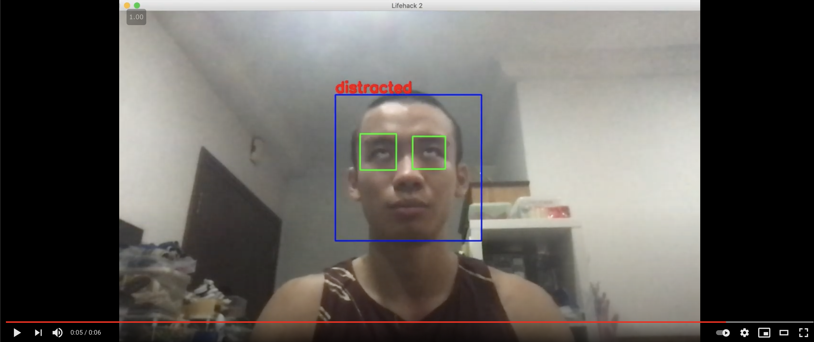

# Nirvana - Reimagining Flipped Classroom Engagement for teachers

[Life hack 2021](https://lifehack-2021.devpost.com/)

Won Most Impressive Usage of Data

Team 
- Kerfui Chang
- Jun leong Hoe
- Carmen Chan
- Yong Kang Chia

### Front End Prototype
https://github.com/hjunleon1999/NirvanaFrontend

Front End Demo : 

https://nirvana-72ef2.web.app/

### How we built Nirvana’s attention tracking software

We built the attention tracking software with computer vision. This was how we approached the problem : 

Step 1: We Used Haar Cascade Face Detector from OpenCV to detect a person's face.

Step 2: After detecting the face, the person's eyes are then located using the OpenCV and a pretrained Convolutional Neural Network (CNN) is used to predict whether a person is distracted or not using a binary classifier. The CNN was trained on eye images created by us where we took open data sets of people who looked distracted and focused as well as data from our faces.

### Video Demo for Computer Vision Software
[](https://youtu.be/SJ1-PvWhSbc "Everything Is AWESOME")

Below table contains all the important scripts in this repo.

| File  | Description  |
|---|---|
| [`get_data.py`](https://github.com/ExtremelySunnyYK/Lifehack-2021/blob/master/src/get_data.py)  | Creates training data for Distraction Classifier  |
| [`train.py`](https://github.com/johannesharmse/ExtremelySunnyYK/Lifehack-2021/master/src/cnn/train.py)  | Creates and trains Distraction Classifier using Keras  |
| [`distraction_detector.py`](https://github.com/ExtremelySunnyYK/Lifehack-2021/blob/master/src/distraction_detector.py)  | Detects distraction using OpenCV and Keras |


### How to run it?
```
pip install 
virtualenv env python=3.6
pip install -r requirements.txt

--Linux/Mac OS--
source env/bin/activate

--Windows--
env/bin/activate

python src/distraction_detector.py
```

### Elevator Pitch
An engagement tracking tool for teachers to view and track their classroom engagement levels. With computer vision, heatmap analytics and an easy-to-use dashboard, Nirvana transforms learning. 


### Impact of Nirvana: 
- Increased engagement levels
- Better student-teacher relationship: Having insights into student engagement levels from the teaching materials to online classes allows teachers to understand more about their student’s individual needs and requirements. This allows teachers to develop more personalised lessons, and also enables them to reach out to students who might require more help. 
- Reduced time and cost in lesson planning


